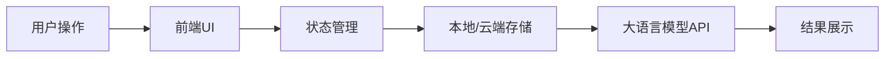

# Aetherflow_final

这是Aetherflow项目的v1初始版本

  <!-- 图片将在后期添加 -->
  <h1 style="color:#4A90E2; font-size:3em;">AetherFlow</h1>
  <h3>AI提示词管理与优化助手</h3>
  
让AI潜能随需释放

  
  

    
    
    
    
  

## 📖 项目简介

<table>
  <tr>
    <td width="100%">
      
AetherFlow（以太流动）是一款创新的Chrome浏览器扩展，致力于帮助用户高效管理和优化AI提示词。在大模型时代，提示词质量直接决定了AI输出效果，我们的产品让用户能够随时随地捕获、优化、存储和复用高质量提示词，显著提升AI交互效率。

    </td>
  </tr>
</table>

  

## ✨ 核心功能

  <table>
    <tr>
      <td align="center" width="33%">
        <h3>提示词快捷输入</h3>
        
使用<kbd>/</kbd>快捷指令瞬间调用已保存的提示词

      </td>
      <td align="center" width="33%">
        <h3>提示词库管理</h3>
        
卡片式设计，直观展示所有已存储提示词

      </td>
      <td align="center" width="33%">
        <h3>提示词优化</h3>
        
基于大语言模型的智能分析与改进

      </td>
    </tr>
  </table>

## 🔄 产品功能流程图

<!-- 
这里将放置产品功能流程图，展示"存-用-改"三大核心节点和四大功能模块的关系。
流程图将展示:
1. 核心节点：改、存、用、AI平台
2. 功能模块：提示词收藏、提示词优化、提示词快捷插入、网页捕获
3. 它们之间的交互关系和数据流向
-->

## 🚀 产品亮点与创新

  
<b>创新性</b>

  <ul>
    <li><b>双模式架构</b>：轻量级模式允许零门槛使用，完整账户模式提供更强大功能，满足不同用户需求</li>
    <li><b>多级优化链</b>：独创的提示词版本管理机制，支持分支优化，保留完整优化历史</li>
    <li><b>浏览器原生集成</b>：无缝融入用户工作流程，不需要额外切换应用</li>
  </ul>

  
<b>业务完整度</b>

  <ul>
    <li><b>全流程覆盖</b>：从提示词捕获、存储、优化到使用的完整闭环</li>
    <li><b>离线支持策略</b>：即使在网络不稳定环境下也能正常使用核心功能</li>
    <li><b>安全设计</b>：严格的数据加密和权限管理，保护用户隐私</li>
  </ul>

  
<b>应用效果</b>

  <ul>
    <li><b>即时响应</b>：联想菜单响应时间<200ms，优化操作响应时间<300ms</li>
    <li><b>高准确率</b>：关键词搜索准确率>95%，提示词插入成功率100%</li>
    <li><b>流畅体验</b>：优雅的交互设计，包括侧边栏宽度调整、最小化/最大化切换</li>
  </ul>

  
<b>商业价值</b>

  <ul>
    <li><b>提升效率</b>：为AI平台用户节省50%以上的提示词编写时间</li>
    <li><b>质量提升</b>：通过优化功能显著提高AI回复质量，降低试错成本</li>
    <li><b>广泛适用性</b>：适用于所有主流AI平台，满足不同场景需求</li>
  </ul>

## 💻 技术实现

<h3>系统架构</h3>
<ul>
  <li>基于React + TypeScript的前端框架</li>
  <li>Chrome Extension Manifest V3规范</li>
  <li>前后端分离设计，支持离线使用</li>
</ul>

<h3>数据流</h3>

<h3>Trae AI编程功能融合</h3>
<table>
  <tr>
    <td><b>Chat功能</b></td>
    <td>用于API接口设计和复杂逻辑规划</td>
  </tr>
  <tr>
    <td><b>Builder功能</b></td>
    <td>快速构建UI组件和状态管理逻辑</td>
  </tr>
  <tr>
    <td><b>自动补全</b></td>
    <td>提升开发效率，确保代码质量</td>
  </tr>
</table>

## 🔮 未来规划

  

    <h3>团队协作功能</h3>
    
允许团队共享和协作编辑提示词库

  

  

    <h3>提示词分析</h3>
    
提供详细使用数据和效果分析

  

  

    <h3>更多平台支持</h3>
    
扩展到Firefox和移动端应用

  

  

    <h3>API接口</h3>
    
为开发者提供程序化访问能力

  

## 👥 团队介绍

  
我们是一支充满激情的团队，拥有丰富的浏览器扩展开发经验和AI应用实践。团队成员来自顶尖互联网公司和研究机构，致力于打造最实用、最高效的AI辅助工具。

## 📞 联系方式

  
  

  

  
<i>AetherFlow - 让AI潜能随需释放</i>

## 观看演示

<!-- 这里将添加演示视频，请参考下方说明进行添加 -->
